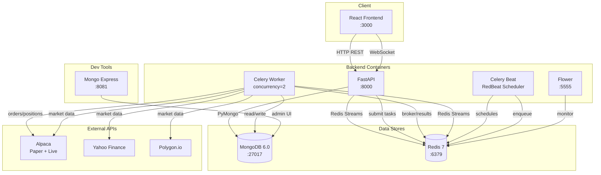

# Bot Club — Backend

FastAPI + Celery backend for Bot Club, a platform for building, backtesting, and deploying algorithmic trading strategies on stocks and crypto via Alpaca.

## Architecture



### Container Breakdown

| Container | Image / Build | Port | Purpose |
|---|---|---|---|
| **backend** | `./backend/Dockerfile` | `8000` | FastAPI app — REST API, WebSocket endpoint, CORS |
| **celery_worker** | `./backend/Dockerfile` | — | Executes trading & backtest tasks across 4 queues |
| **celery_beat** | `./backend/Dockerfile` | — | Schedules recurring stock-trading tasks via RedBeat |
| **flower** | `./backend/Dockerfile` | `5555` | Celery monitoring dashboard |
| **mongo** | `mongo:6.0` | `27017` | Primary data store (users, strategies, sessions, portfolios, backtests) |
| **redis** | `redis:7-alpine` | `6379` | Celery broker, beat schedule store, concurrency locks, WebSocket streams |
| **mongo-express** | `mongo-express:latest` | `8081` | MongoDB admin UI (dev profile only) |

### Task Queues

| Queue | Task | Description |
|---|---|---|
| `live_trading` | `run_live_strategy` | Continuous trading loop against Alpaca live account |
| `paper_trading` | `run_paper_strategy` | Continuous trading loop against Alpaca paper account |
| `backtesting` | `run_backtest_task` | Backtest pipeline — fetch data → execute strategy → save results |
| `control` | `stop_live_strategy` | Revoke running tasks, release locks, mark sessions stopped |

## Project Structure

```
backend/
├── src/
│   ├── main.py                  # FastAPI app, lifespan, WebSocket, CORS
│   ├── celery_app.py            # Celery config, queue routing, beat scheduler
│   ├── config.py                # Environment variables & settings
│   ├── dependencies.py          # FastAPI dependency injection
│   │
│   ├── routes/                  # API endpoints
│   │   ├── auth.py              #   /api/auth — register, login, Google OAuth2
│   │   ├── user.py              #   /api/users — profiles
│   │   ├── user_config.py       #   /api/user-config — encrypted API key storage
│   │   ├── strategy.py          #   /api/strategy — CRUD, toggle, backtest listing
│   │   ├── backtest_routes.py   #   /api/backtest — run, poll, results, deploy
│   │   └── trading_routes.py    #   /api/trading — start/stop, sessions, status
│   │
│   ├── models/                  # Pydantic models
│   │   ├── user.py              #   User, Token
│   │   ├── strategy.py          #   Strategy, RiskManagement, DollarCostAverage
│   │   ├── backtest.py          #   BacktestParams, BacktestMetrics, TradeDetail
│   │   ├── trading_session.py   #   TradingSession, TradingSessionConfig
│   │   ├── user_config.py       #   Encrypted config storage
│   │   └── portfolio_models.py  #   StrategyPortfolio, PositionLot, CompletedTrade
│   │
│   ├── crud/                    # Database operations
│   │   ├── user.py
│   │   ├── strategy.py
│   │   └── backtest.py
│   │
│   ├── database/
│   │   └── client.py            # MongoDB singleton (local or Atlas)
│   │
│   ├── services/
│   │   ├── default_strategies.py      # Loads YAML strategy templates on startup
│   │   ├── trading/
│   │   │   ├── alpaca_client.py       # Alpaca REST wrapper (paper + live)
│   │   │   └── live_strategy_runner.py  # Main trading loop — indicators, conditions, orders, risk mgmt
│   │   ├── backtest/
│   │   │   └── backtest_runner.py     # Backtest orchestration
│   │   └── data_retrieval/
│   │       ├── data_manager.py        # Multi-provider data fetcher
│   │       └── data_providers.py      # Yahoo Finance, Alpaca, Polygon adapters
│   │
│   ├── tasks/
│   │   ├── trading_tasks.py     # Celery tasks for live/paper trading + stop
│   │   └── backtest_task.py     # Celery task for backtesting
│   │
│   └── utils/
│       ├── redis_client.py            # Async Redis client
│       ├── websocket_manager.py       # WebSocket ↔ Redis Stream bridge
│       ├── strategy_executor.py       # Backtest strategy engine
│       ├── live_strategy_executor.py  # Live strategy engine
│       ├── indicator_factory.py       # Technical indicator computation (polars-talib)
│       ├── condition_checker.py       # Condition evaluation (crosses_above, etc.)
│       ├── asset_classifier.py        # Crypto vs stock classification
│       ├── performance_calculator.py  # Sharpe, drawdown, win rate, etc.
│       ├── portfolio_persistence.py   # Portfolio save/load to MongoDB + Redis streams
│       ├── security.py               # bcrypt hashing, JWT tokens
│       └── ...
│
├── data/strategy_examples/      # Default YAML strategy templates
├── Dockerfile
├── requirements.txt
└── .env                         # Local environment variables (not committed)
```

## API Endpoints

### Authentication — `/api/auth`
| Method | Path | Description |
|---|---|---|
| `POST` | `/register` | Register a new user |
| `POST` | `/token` | Login → JWT access token |
| `GET` | `/google/login` | Initiate Google OAuth2 |
| `GET` | `/google/callback` | Google OAuth2 callback |

### Users — `/api/users`
| Method | Path | Description |
|---|---|---|
| `GET` | `/me` | Current user profile |
| `PUT` | `/me` | Update profile |

### User Config — `/api/user-config`
| Method | Path | Description |
|---|---|---|
| `GET` | `/` | Get config (decrypted) |
| `POST` | `/alpaca` | Save Alpaca API keys (Fernet-encrypted) |
| `POST` | `/polygon` | Save Polygon API key |
| `DELETE` | `/alpaca` | Remove Alpaca config |
| `DELETE` | `/polygon` | Remove Polygon config |

### Strategies — `/api/strategy`
| Method | Path | Description |
|---|---|---|
| `GET` | `/user_strategies` | List user's strategies |
| `GET` | `/default` | Default strategy templates |
| `POST` | `/` | Create strategy |
| `PUT` | `/{id}` | Update strategy |
| `DELETE` | `/{id}` | Delete strategy + backtests |
| `POST` | `/{id}/toggle` | Toggle active/inactive |

### Backtesting — `/api/backtest`
| Method | Path | Description |
|---|---|---|
| `POST` | `/run` | Start a backtest |
| `GET` | `/status/{id}` | Poll backtest progress |
| `GET` | `/results/{id}` | Fetch completed results |
| `POST` | `/deploy` | Deploy strategy from backtest to live/paper |

### Trading — `/api/trading`
| Method | Path | Description |
|---|---|---|
| `POST` | `/run` | Start live or paper trading |
| `POST` | `/stop` | Stop trading session |
| `GET` | `/active` | List active sessions |
| `GET` | `/session/{id}` | Session details (portfolio, positions, trades) |

### WebSocket
| Path | Description |
|---|---|
| `ws://host:8000/ws/task/{task_id}` | Real-time Celery task log streaming via Redis Streams |

## Setup

### Docker (recommended)

From the project root:

```bash
docker compose up -d --build
```

Services will be available at:
- **API**: http://localhost:8000
- **API Docs**: http://localhost:8000/docs
- **Flower**: http://localhost:5555
- **Mongo Express** (dev): `docker compose --profile dev up -d mongo-express` → http://localhost:8081

### Local Development

```bash
cd backend
python -m venv venv
venv\Scripts\activate        # Windows
pip install -r requirements.txt
```

Create a `.env` file with:

```env
MONGO_URL=mongodb://localhost:27017
MONGO_DB_NAME=bot_club_db
REDIS_URL=redis://localhost:6379/0
LOCAL_DB=true
CONFIG_ENCRYPTION_KEY=<generate with generate_encryption_key.py>
```

Run the API:

```bash
uvicorn src.main:app --reload --port 8000
```

Run a Celery worker:

```bash
celery -A src.celery_app worker --loglevel=info --concurrency=2 -Q live_trading,paper_trading,backtesting,control
```

Run Celery Beat:

```bash
celery -A src.celery_app beat -S redbeat.RedBeatScheduler --loglevel=info
```

## Key Dependencies

| Category | Packages |
|---|---|
| Web framework | FastAPI, uvicorn |
| Database | pymongo, motor |
| Task queue | celery, celery-redbeat, flower |
| Auth | python-jose, passlib, bcrypt |
| Encryption | cryptography (Fernet) |
| Market data | yfinance, aiohttp, httpx |
| Data processing | pandas, numpy, polars-talib |
| Config | pydantic, python-dotenv, PyYAML |